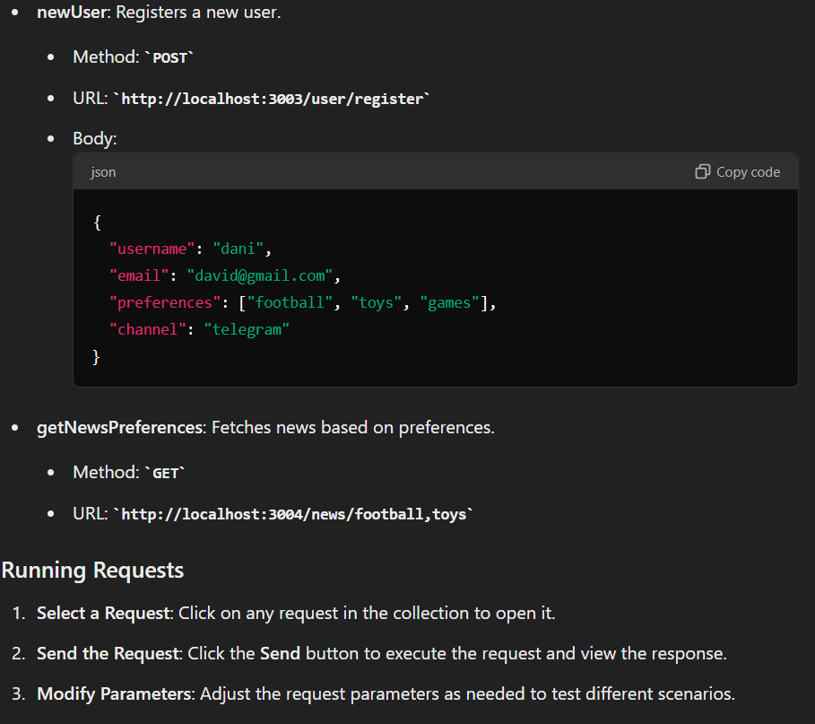

# Microservices Project

## Overview

This project consists of three microservices: User Service, News Service, and Notification Service. Each service is responsible for specific functionality.

## Services

### User Service

- **Port**: 3003
- **Description**: Manages user data and preferences.
- **Endpoints**:
  - `GET /user/all-users` - Fetch all users.
  - `GET /user/:id` - Fetch user details by id.
  - `POST /user/register` - Register a new user.
  - `PATCH /user/preferences` - Update user preferences.

### News Service

- **Port**: 3004
- **Description**: Fetches news based on user preferences.
- **Endpoints**:
  - `GET /news/:preferences` - Fetch news based on user preferences.

### Notification Service

- **Port**: 3002
- **Description**: Sends notifications via email and Telegram.
- **Endpoints**:
  - `POST /email/send` - Send email notification.
  - `POST /telegram/send` - Send Telegram notification.

## Running the Project with Docker Compose

### Prerequisites

- **Docker**: Ensure Docker is installed on your machine. You can download it from [Docker's official website](https://www.docker.com/products/docker-desktop).
- **Docker Compose**: This is included with Docker Desktop.

### Running the Services

1. **Navigate to the Project Directory**: Open a terminal and navigate to the root directory of your project where the `docker-compose.yml` file is located.

2. **Build the Docker Images** (optional): If you need to build the images first, run:
   docker-compose build

